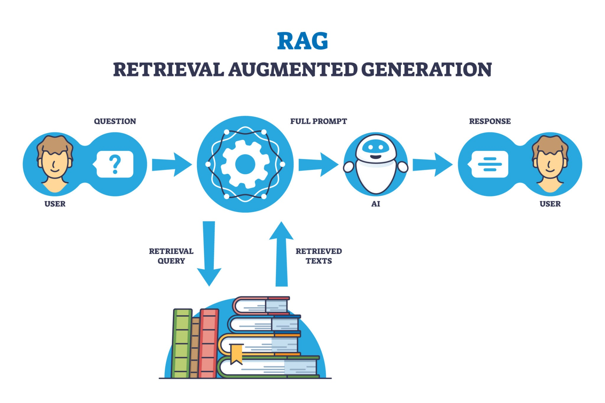

## ⚙️ 1. Configuração do Ambiente (`.env`)

O SamBot utiliza um sistema de **Pool de Chaves**. Se uma chave atingir o limite de requisições (*Rate Limit*), o sistema rotaciona automaticamente para a próxima.

Crie um arquivo `.env` na raiz e preencha conforme o modelo:

```env
# --- Discord ---
DISCORD_TOKEN=seu_token_aqui
OWNER_ID=seu_id_de_usuario

# --- Inteligência Artificial (Google Gemini) ---
GEMINI_API_KEY=chave_principal
GEMINI_API_KEY_1=chave_reserva_1
GEMINI_API_KEY_2=chave_reserva_2

# Modelo Sugerido
GEMINI_MODEL_NAME=models/gemini-1.5-flash

# --- Opcional: Ollama (IA Local para Failover) ---
OLLAMA_HOST=http://host.docker.internal:11434
MODEL_FAST_LOCAL=qwen2.5:1.5b

# --- Lavalink (Música) ---
LAVALINK_HOST=lavalink
LAVALINK_PORT=2333
LAVALINK_PASSWORD=youshallnotpass

```

---

## 🎨 2. Personalização do Agente

### Mudando a Personalidade

O comportamento é regido pelos arquivos em `Data/Prompts/`.

* **Edição:** Altere o arquivo `padrao.txt` para definir o tom de voz (ex: prestativo, sarcástico, técnico).
* **Sistema de Personas:** Você pode criar novos arquivos (ex: `pirata.txt`) para alternar estilos de resposta via código ou comandos futuros.

### Identidade e Status

* **`identity.json`:** Localizado em `Data/Persistence/`. Define fatos imutáveis (Nome, Criador, Data de Criação). Isso serve como a "âncora de realidade" da IA.
* **`atividades.json`:** Localizado em `Data/Knowledge/`. O bot alterna entre as frases deste arquivo quando não há música tocando.

---

## 🎮 3. Funcionalidades de Usuário

### 🗣️ Conversa com IA

Não há necessidade de prefixos para falar com a IA. Basta mencionar o bot ou responder:

> **User:** `@SamBot` você conhece o Tachi?

> **SamBot:** (Analisa a memória RAG e o histórico) Sim, ele é meu criador e gosta de Jazz!
---
### 🧠 Memória Persistente (RAG)

O bot monitora conversas para extrair informações relevantes sobre os usuários.

* **Como ensinar:** "Meu prato favorito é lasanha" ou "Eu trabalho como programador".
* **Como recuperar:** "O que você sabe sobre mim?" ou "Qual meu hobby?".


---
### 🎵 Comandos de Música

O sistema utiliza **Wavelink** para garantir baixa latência e alta fidelidade.

| Comando | Ação |
| --- | --- |
| `!play [link/nome]` | Adiciona música à fila (Suporta YT/Spotify). |
| `!skip` | Pula para a próxima faixa. |
| `!queue` | Exibe a lista de reprodução atual. |
| `!stop` | Limpa a fila e desconecta o bot. |

---

## 🛠️ 4. Comandos de Administração

Comandos restritos ao `OWNER_ID` definido no `.env`:

* **`!reload`**: Recarrega os Cogs (módulos) sem precisar reiniciar o processo do Python ou o container Docker.

---

