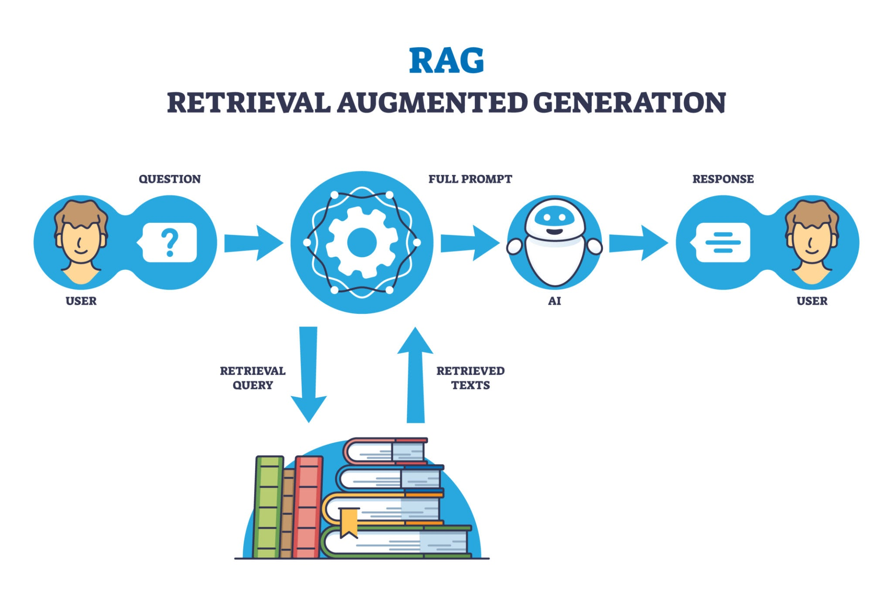

## ⚙️ 1. Configuração do Ambiente (`.env`)

A SamBot possui uma arquitetura altamente resiliente. Ela pode funcionar **apenas com o Gemini**, **apenas com o Ollama**, com **ambos** (ativando o sistema de _Failover_), ou até **sem nenhum** (o bot liga normalmente para comandos de música e utilidade, mas fica "sem cérebro" para conversas).

Use o `.env.example` ou crie um novo arquivo `.env` na raiz e preencha conforme o modelo:

```env
# --- Discord (Obrigatório) ---
DISCORD_TOKEN=seu_token_aqui
OWNER_ID=seu_id_de_usuario
BOT_PREFIX="+"

# --- Lavalink / Música (Obrigatório para o módulo de áudio) ---
LAVALINK_HOST=lavalink
LAVALINK_PORT=2333
LAVALINK_PASSWORD=youshallnotpass

# --- Inteligência Artificial: Nuvem (Opcional) ---
GEMINI_API_KEY=chave_principal
GEMINI_API_KEY_1=chave_reserva_1
GEMINI_API_KEY_2=chave_reserva_2
GEMINI_MODEL_NAME="gemini-2.0-flash" # Sugerido: flash pela velocidade

# --- Inteligência Artificial: Local (Opcional) ---
OLLAMA_LOCAL_URL="http://host.docker.internal:11434"
MODEL_FAST_LOCAL="qwen2.5:1.5b"
MODEL_EMBED_LOCAL="nomic-embed-text:latest"

# --- Configurações Ollama: Remoto (Opcional) ---
# Remoto (ex: sua workstation rodando via IP do Tailscale)
OLLAMA_REMOTE_URL="http://ip_tailscale_workstation:11434"
MODEL_SMART_REMOTE="phi3.5:latest"
MODEL_EMBED_REMOTE="nomic-embed-text:latest"

# --- API Keys de Serviços Externos (Opcional) ---
KLIPY_API_KEY="sua_chave_klipy"
STEAM_API_KEY="sua_chave_steam"
PIXABAY_API_KEY="sua_chave_pixabay"

# --- Google Custom Search API (Opcional) ---
GOOGLE_SEARCH_API_KEY="sua_chave_google_search"
GOOGLE_SEARCH_CX="seu_id_cx"
YOUTUBE_PLAYLIST_ID="id_da_sua_playlist"

# --- Brave Search API (Backup de busca) ---
BRAVE_SEARCH_API_KEY="sua_chave_brave"

# --- IGDB API (Informações de Jogos) ---
IGDB_CLIENT_ID="seu_client_id"
IGDB_CLIENT_SECRET="seu_client_secret"

```

---

## 🎨 2. Personalização do Agente

### Mudando a Personalidade

O comportamento é regido pelos arquivos em `Data/Prompts/`.

- **Edição:** Altere o arquivo `padrao.txt` para definir o tom de voz (ex: prestativo, sarcástico, técnico).
- **Sistema de Personas:** Você pode criar novos arquivos (ex: `pirata.txt`) para alternar estilos de resposta via código ou comandos futuros.

### Identidade e Status

- **`identity.json`:** Localizado em `Data/Persistence/`. Define fatos imutáveis (Nome, Criador, Data de Criação). Isso serve como a "âncora de realidade" da IA.
- **`atividades.json`:** Localizado em `Data/Knowledge/`. O bot alterna entre as frases deste arquivo quando não há música tocando.

---

## 🎮 3. Funcionalidades de Usuário

### 🗣️ Conversa com IA

Não há necessidade de prefixos para falar com a IA. Basta mencionar o bot ou responder:

> **User:** `@SamBot` você conhece o Tachi?

> **SamBot:** (Analisa a memória RAG e o histórico) Sim, ele é meu criador e gosta de Jazz!

---

### 🧠 Memória Persistente (RAG)

O bot monitora conversas para extrair informações relevantes sobre os usuários.

- **Como ensinar:** "Meu prato favorito é lasanha" ou "Eu trabalho como programador".
- **Como recuperar:** "O que você sabe sobre mim?" ou "Qual meu hobby?".

## 

### 🎵 Comandos de Música

O sistema utiliza **Wavelink** para garantir baixa latência e alta fidelidade.

| Comando             | Ação                                         |
| ------------------- | -------------------------------------------- |
| `!play [link/nome]` | Adiciona música à fila (Suporta YT/Spotify). |
| `!skip`             | Pula para a próxima faixa.                   |
| `!queue`            | Exibe a lista de reprodução atual.           |
| `!stop`             | Limpa a fila e desconecta o bot.             |

---

## 🛠️ 4. Comandos de Administração

Comandos restritos ao `OWNER_ID` definido no `.env`:

- **`!reload`**: Recarrega os Cogs (módulos) sem precisar reiniciar o processo do Python ou o container Docker.

---
